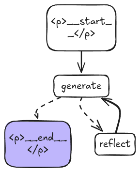

# Basic Reflection Agent
- [Excali Draw](https://excalidraw.com/) Used to Convert mermaid diagram to graph.
- [Cource Reference](https://github.com/emarco177/langgraph-course/tree/project/reflection-agent)

