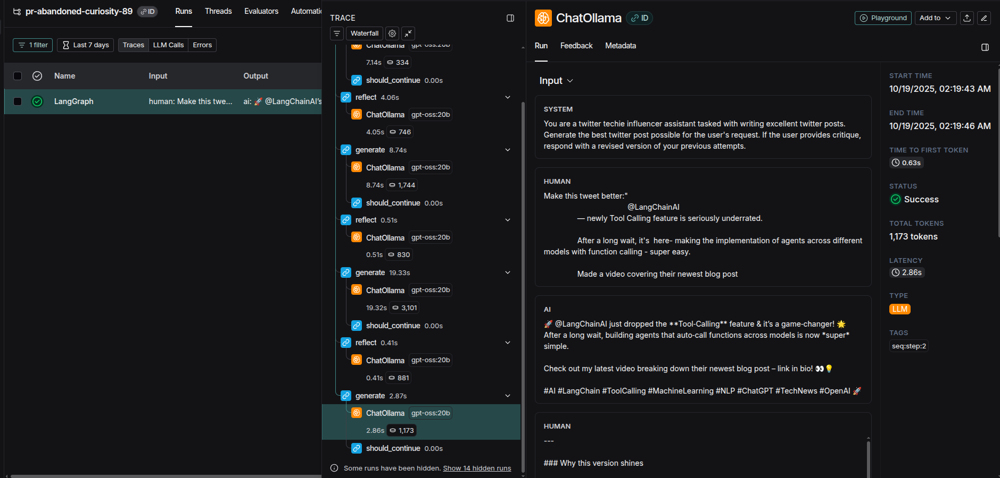
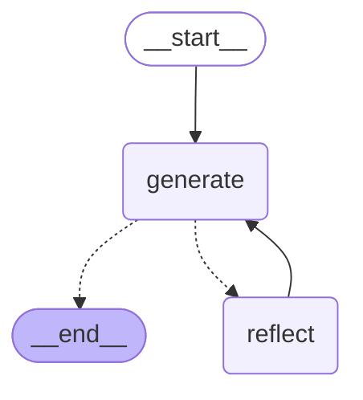

# Basic Reflection Agent
- [Excali Draw](https://excalidraw.com/) Used to Convert mermaid diagram to graph.
- [Cource Reference](https://github.com/emarco177/langgraph-course/tree/project/reflection-agent)
- [LangSmith Tracing](https://smith.langchain.com/o/032efef2-c6bd-42e8-9c4f-424e2da7cf1f/projects/p/c8fd8dce-bf7e-45cb-9110-e83fad7e5c1e?timeModel=%7B%22duration%22%3A%227d%22%7D&peek=308b5e19-cfde-4823-a685-2de06fae8e71&peeked_trace=e4fe4317-0641-46f1-8387-0b638c1ab3cd)



## Mermaid diagram:


| **Section**            | **Description**                                                                 |
|-------------------------|---------------------------------------------------------------------------------|
| **Flowchart Purpose**   | Represents a process with a starting point, a generation step, a reflection step, and an iterative loop, leading to an endpoint. |
| **Mermaid Code**        | ```mermaid<br>graph TD;<br>&nbsp;&nbsp;__start__([<p>__start__</p>]):::first<br>&nbsp;&nbsp;generate(generate)<br>&nbsp;&nbsp;reflect(reflect)<br>&nbsp;&nbsp;__end__([<p>__end__</p>]):::last<br>&nbsp;&nbsp;__start__ --> generate;<br>&nbsp;&nbsp;generate -.-> __end__;<br>&nbsp;&nbsp;generate -.-> reflect;<br>&nbsp;&nbsp;reflect --> generate;<br>&nbsp;&nbsp;classDef default fill:#f2f0ff,line-height:1.2<br>&nbsp;&nbsp;classDef first fill-opacity:0<br>&nbsp;&nbsp;classDef last fill:#bfb6fc<br>``` |
| **Nodes**               | - `__start__`: Entry point of the flowchart (styled with transparent fill).<br>- `generate`: Represents the generation step.<br>- `reflect`: Represents the reflection step.<br>- `__end__`: Exit point of the flowchart (styled with a purple fill). |
| **Edges**               | - `__start__ --> generate`: Flow begins from start to generation.<br>- `generate -.-> __end__`: Optional path from generation to end (dotted line).<br>- `generate -.-> reflect`: Optional path from generation to reflection (dotted line).<br>- `reflect --> generate`: Loop back from reflection to generation. |
| **Styles**              | - Default nodes: Light purple fill (`#f2f0ff`).<br>- `__start__`: Transparent fill (`fill-opacity:0`).<br>- `__end__`: Purple fill (`#bfb6fc`). |
| **How to Use**          | 1. Copy the Mermaid code into a Mermaid-compatible editor (e.g., Mermaid Live Editor, GitHub Markdown, or VS Code with Mermaid plugins).<br>2. Render the flowchart to visualize the process.<br>3. Modify node names or styles as needed for your specific use case. |
| **Dependencies**        | - Mermaid.js (for rendering the flowchart).<br>- Compatible platforms: GitHub, Mermaid Live Editor, or any Markdown renderer supporting Mermaid. |
| **Example Output**      | The flowchart visualizes a process starting at `__start__`, moving to `generate`, with optional paths to either `__end__` or `reflect`, and a loop from `reflect` back to `generate`. See the provided image (`img.png`) for a rendered example. |
| **File Included**       | - `img.png`: A sample rendered image of the flowchart. |

## Example Render


